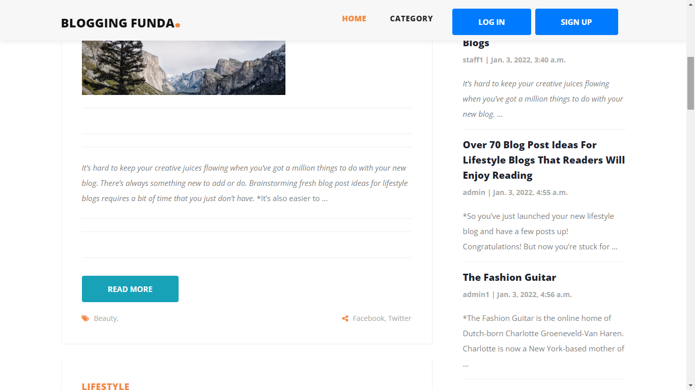
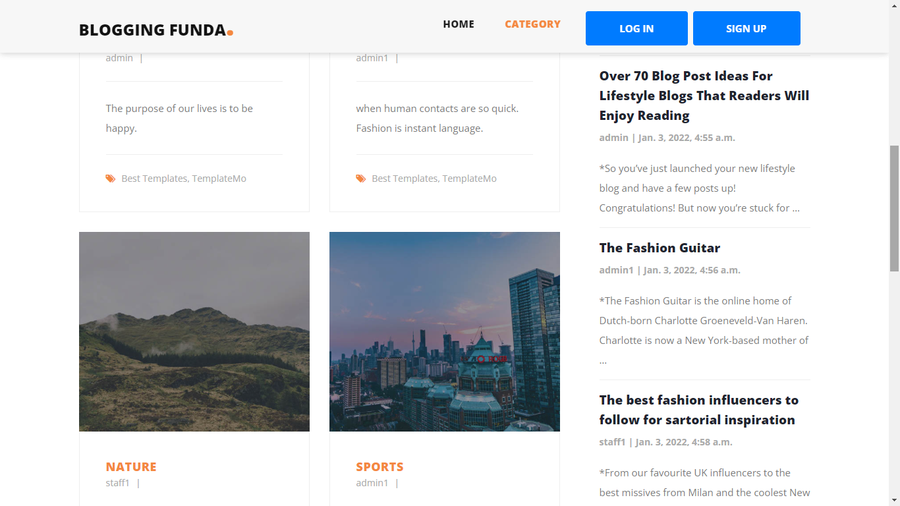
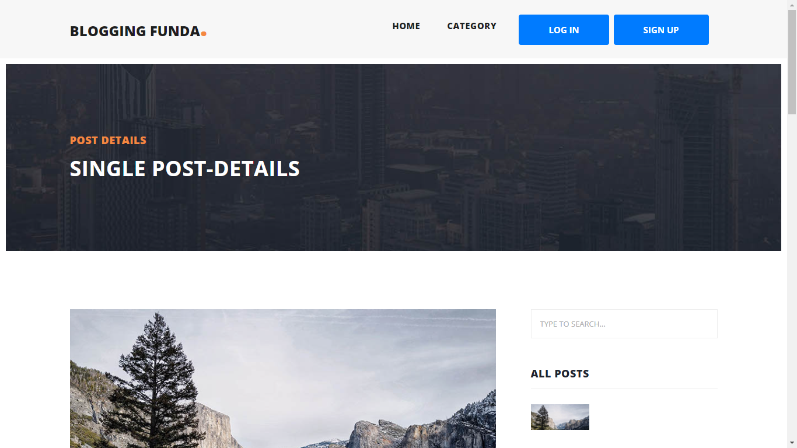
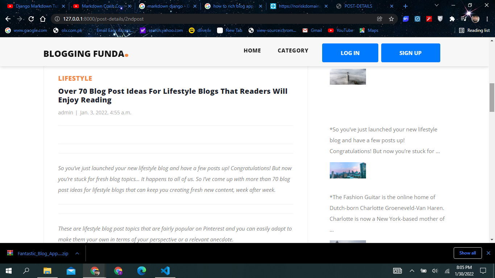
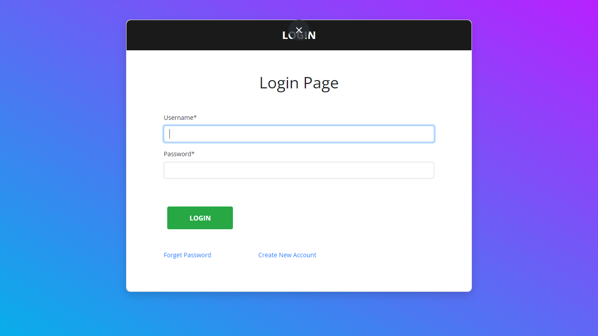
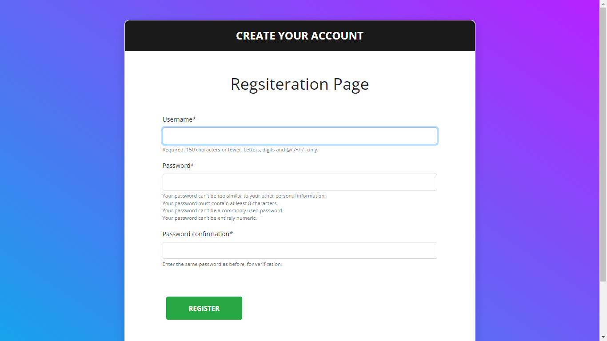
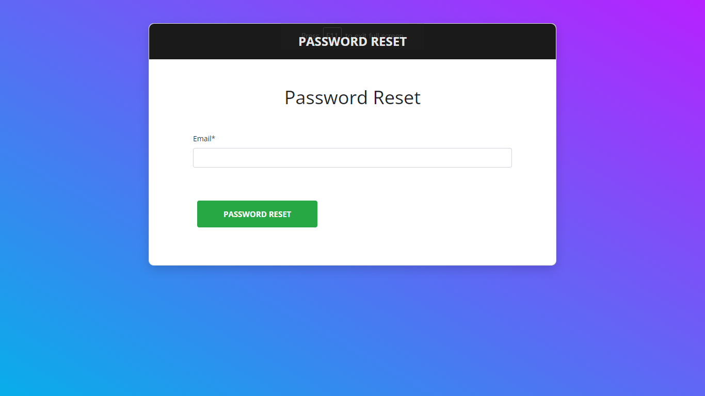
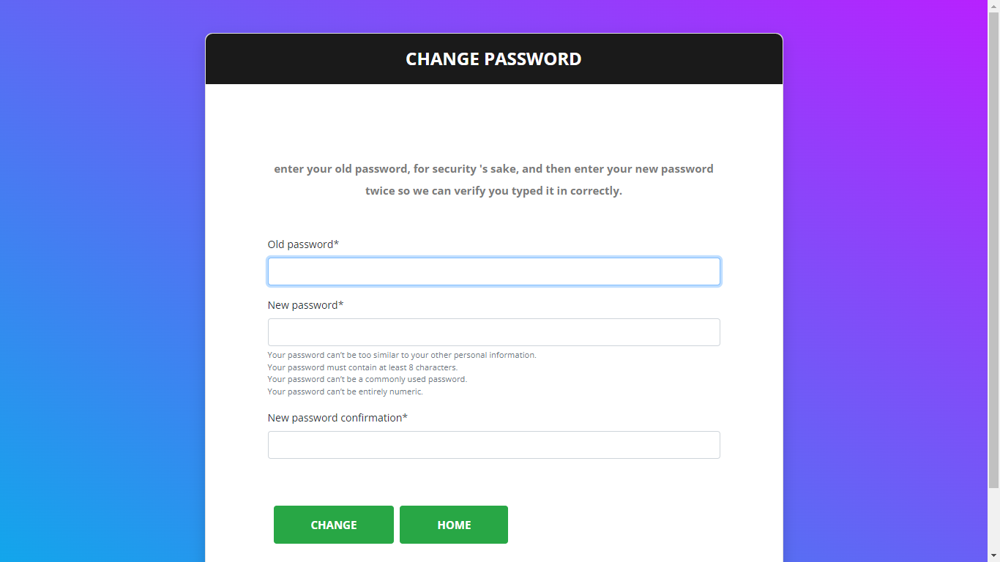

# Simple Blog Application with Markdown support #

# Home Page #

## After login Home Page ##

___
# catogery #

___
# Single Post Details Page #

___
# Login Page #

___
# Singup Page#

___
# Password Rest #

___
# Change Password #

___
# Change password Logout #
"# Blog-Application" 
